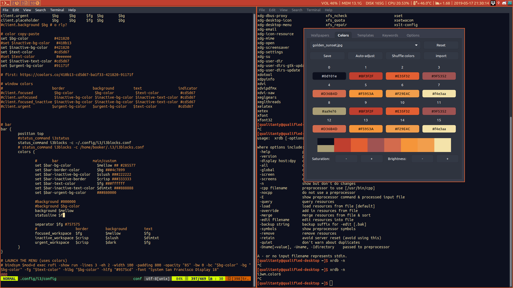

```
         __      __  _____ __         
    ____/ /___  / /_/ __(_) /__  _____
   / __  / __ \/ __/ /_/ / / _ \/ ___/
 _/ /_/ / /_/ / /_/ __/ / /  __(__  ) 
(_)__,_/\____/\__/_/ /_/_/\___/____/  
                                      
```

# *totally qualified dotfiles*
## Using GNU stow with simple packages


## Naming convention:

```
package
_no-package
```
...just do
```bash
stow --no-folding <package>
```
to install

--no-folding prevents stow from symlinking an entire folder to a folder in the package, which I found to be a problem with the .vim folder when reinstalling.

## Table of deets

|    type of deet | deet of deet        |
| --------------: | :------------------ |
|     Color theme | ashes/onedark/tanuki|
|  Window manager | bspwm               |
|        Terminal | alacritty/urxvt     |
|     Text editor | vim/vscode/intellij |
|        Launcher | rofi                |
|             Bar | polybar             |
|         Browser | Firefox/qutebrowser |
|           Music | spotify/mpv         |
|           Video | Kodi/mpv            |
|           Fetch | custom in `scripts` |
|             ... | and so on           |

## pywal pipeline

`wal -R` in i3conf to reload colors&wallpaper from cache, wal sets wallpaper by itself.

See [pywal's Getting Started page](https://github.com/dylanaraps/pywal/wiki/Getting-Started#applying-the-theme-to-new-terminals) for the two snippets I put in .bashrc to make terminals that do not fetch colors from .Xresources have pywal colors, including TTYs.  
Using templates for various apps (Zathura, Firefox startpage etc.) and xrdb queries for other apps (polybar, spotify etc.).

When setting new theme (function in .bashrc):  
`wal -i <image>` obviously  
`wal_steam` if Steam is installed  

Using spicetify to theme Spotify based on pywal colors, theme is [Lovelace](https://github.com/morpheusthewhite/spicetify-themes/tree/master/Lovelace) by [adriankarlen](https://github.com/adriankarlen)

[firefox theming](https://github.com/Frewacom/Pywalfox)

## links and credits

*Based on [F-dotfiles](https://github.com/Kraymer/F-dotfiles)*

[text to ASCII](http://www.patorjk.com/software/taag/#p=display&f=Slant&t=.dotfiles)  

## old showcases

Modified github light theme:  
(yes, the tray icons are too light – I didn't bother changing them)


Pleasantly purple wallpaper with `ashes` colorscheme:


Way too dim colors:  


Pywalled garden and the time of 0 padding:  


Almost default polybar:  


Nothing but i3blocks:  

